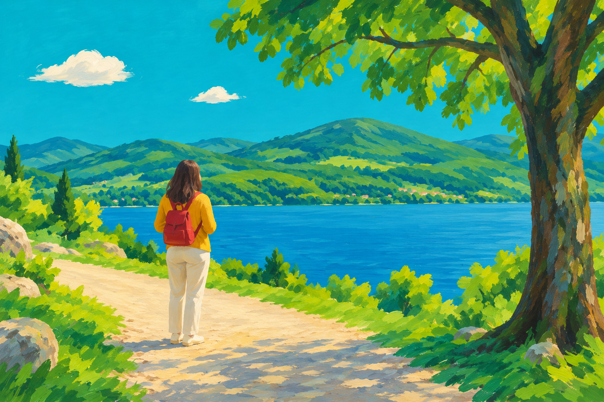
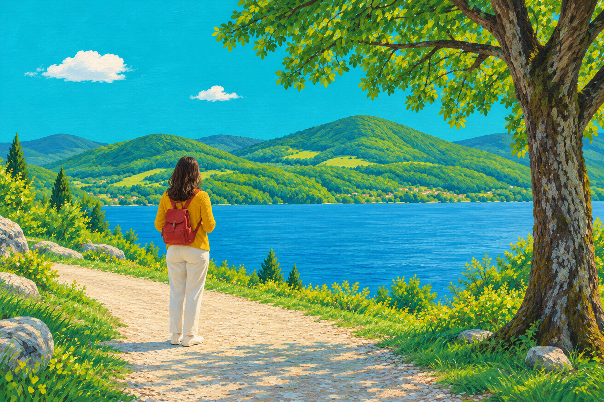
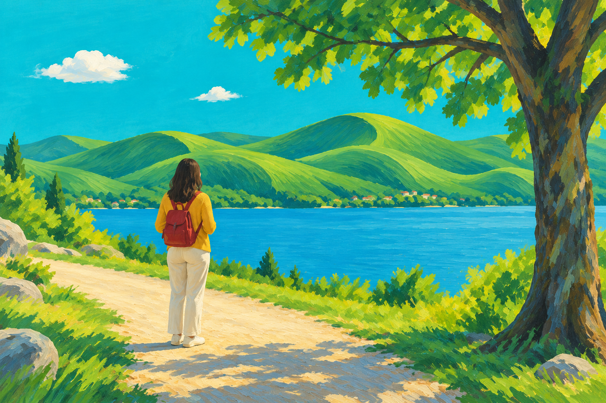
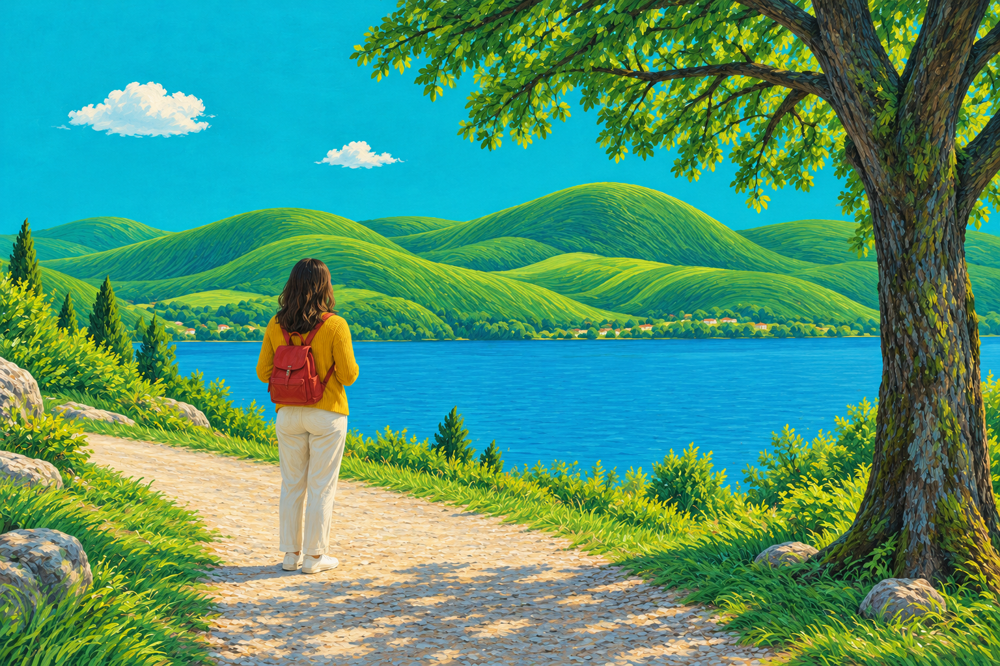
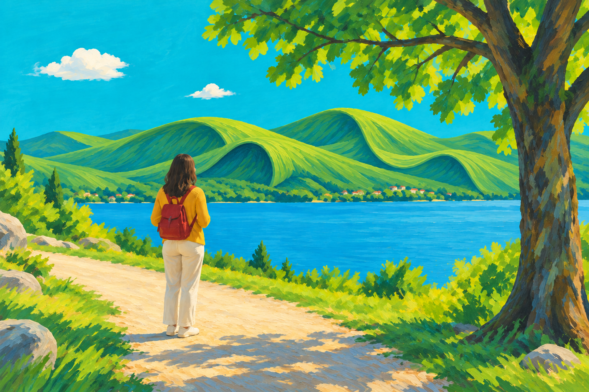

# 四组合对照与一次定向修正 · 2026-10-09

同一张自主生成的照片、同一幅实际查看的风格参考图，四个组合各生成一次；另对强烈梦幻＋松散结果修正一次。共五次内置 image_gen 调用取得五张图片，没有外部 API。

原图：[湖边人物照片](../测试原图.png)。参考：[Mulgil Kim, Green Wave (2025)](https://www.artsy.net/artwork/mulgil-kim-green-wave)，实际获取并查看后作为第二张输入图。参考原画不打包在仓库中。

固定参数：适度重构（仅限远处山坡）、绿蓝色、原图日光、平整哑光水粉、原图横向 3:2。完整提示、输入及来源见 [参数与实际提示词](参数与实际提示词.json)。图片工具没有可设的 seed；每组只有一个随机样本，以下为 agent 定性观察，不是统计证明或独立评审。

## 四组首次输出

| | 松散笔触 | 细腻笔触 |
| --- | --- | --- |
| 轻微梦幻 |  |  |
| 强烈梦幻 |  |  |

| 比较 | 实际观察 |
| --- | --- |
| A 与 B | A 的植物、地面、树皮更概括，笔触较宽；B 的树叶、地面纹理与植被细节更密。笔触控制在此例可见。 |
| C 与 D | 同样有松散与细腻差异；D 的细密草纹沿山坡连续弯曲，细腻没有使流动形态消失。 |
| 轻微与强烈组 | 轻微组较接近自然山坡；强烈组出现统一、流动的轮廓，但未充分实现明确卷边、背面与空隙。强烈结构变化首次只部分达到。 |
| 共同表现 | 人物背影、黄色上衣、浅色裤子、红背包、右侧树、小路与湖面关系保留；未见参考图的冲浪者、冲浪板或花环搬入。天空与植物采用不同处理。 |

本轮同时调整提示并加入参考图，不能将相对首版的变化单独归因于参考图。四组之间也有生成随机性导致的细部差异。

## 一次定向修正

以 C 为编辑目标，原图只用于核对；将“布料般山坡”明确为“翻折卷边、可见背面、卷边下的空隙”，要求保留其他区域与松散笔触。C 是 agent 自主选的测试基准，不代表用户已表示满意。

结果出现明确卷边与折叠，松散笔触、人物与主要场景关系基本保住。衣物、地面、水面等局部笔触仍有细微变化，不能声称只改变山坡像素。实际提示见 [定向修正提示词](定向修正提示词.md)。该图独立保存，不替换 C 或冒充四组首次输出。

## 反馈到 skill

- 加入实际作品参考的获取、查看与角色区分。
- 梦幻参数落到既有元素的具体形态，强烈结构变化明确可见卷边等特征。
- 提供三个完整快捷预设及参数图示，接受自由组合，不自动代替用户选择。
- 局部修改以最新满意图为目标，原图辅助核对，新版本不覆盖满意图。本轮仅测试山坡修正，尚未单独测试“只把笔触放松”的情境。

本例支持笔触区分和一次结构修正，不能证明画家风格被准确或稳定复现，也不能代表人物正面、城市、宠物、透明背景或其他参数全部有效。
